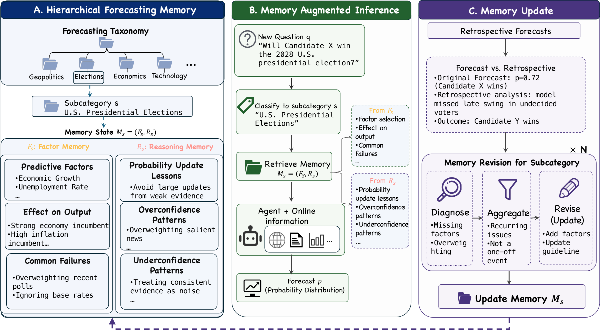

<h1 align="center">
  🧭 ForecastCompass<br>
  Guiding Agentic Forecasting with Adaptive Factor Memory
</h1>

<p align="center">
  <a href="https://arxiv.org/abs/2605.30858">
    
  </a>
</p>


<p align="center">
  <a href="#overview">🧭 Overview</a> ·
  <a href="#method">💡 Method</a> ·
  <a href="#results">📊 Results</a> ·
  <a href="#quick-start">🚀 Quick Start</a> ·
  <a href="#citation">📝 Citation</a>
</p>

---

<a id="overview"></a>
## Overview

Official repository for the paper
[**ForecastCompass: Guiding Agentic Forecasting with Adaptive Factor Memory**](https://arxiv.org/pdf/2605.30858).

ForecastCompass is a memory-augmented probabilistic forecasting framework for agentic forecasting.

Given prediction-market questions from platforms such as Prophet Arena and FutureX, the model performs forecasting over time and maintains adaptive factor memory learned from historical forecasting outcomes. The learned memory can then guide forecasting on future, held-out questions.

<a id="method"></a>
## 💡 Method

FOCO organizes memory by forecasting subcategory:

- **Factor memory** records predictive signals, evidence checks, failure modes, and probability effects.
- **Reasoning memory** guides calibration under uncertainty, conflicting signals, and incomplete evidence.

New questions retrieve relevant memory to guide search and probability estimation. After resolution, original and retrospective trajectories are contrasted through **diagnose → aggregate → revise**. Revisions retain reusable lessons and filter event-specific hindsight. Only past resolved questions update memory.

<p align="center">
  
</p>

*Figure 2. Framework overview from the paper. A: hierarchical factor and reasoning memory. B: memory-augmented forecasting. C: retrospective memory revision.*

Method: [paper, Section 3](https://arxiv.org/pdf/2605.30858).

---

<a id="results"></a>
## 📊 Main Results

### Table 1 · Main results

Average Brier and ECE scores across the four evaluation weeks, reproduced from [Table 1 of the paper](https://arxiv.org/pdf/2605.30858). **Lower is better** for both metrics. All methods, values, and bold entries follow the LaTeX source.

<table>
  <thead>
    <tr><th rowspan="3">Method</th><th colspan="4">GPT-5-mini</th><th colspan="4">Gemini-2.5-Flash</th></tr>
    <tr><th colspan="2">Prophet Arena</th><th colspan="2">FutureX</th><th colspan="2">Prophet Arena</th><th colspan="2">FutureX</th></tr>
    <tr><th>Brier ↓</th><th>ECE ↓</th><th>Brier ↓</th><th>ECE ↓</th><th>Brier ↓</th><th>ECE ↓</th><th>Brier ↓</th><th>ECE ↓</th></tr>
  </thead>
  <tbody>
  <tr><td>BASE (Retro)</td><td align="center">0.109</td><td align="center">0.079</td><td align="center">0.197</td><td align="center">0.209</td><td align="center">0.187</td><td align="center">0.098</td><td align="center">0.241</td><td align="center">0.279</td></tr>
  <tr><td>BASE</td><td align="center">0.150</td><td align="center">0.114</td><td align="center">0.241</td><td align="center">0.263</td><td align="center">0.202</td><td align="center">0.106</td><td align="center">0.266</td><td align="center">0.299</td></tr>
  <tr><td>MEM0</td><td align="center">0.149</td><td align="center">0.101</td><td align="center">0.197</td><td align="center">0.217</td><td align="center">0.208</td><td align="center">0.125</td><td align="center">0.272</td><td align="center">0.296</td></tr>
  <tr><td>REFLEXION</td><td align="center">0.150</td><td align="center">0.086</td><td align="center">0.203</td><td align="center">0.222</td><td align="center">0.196</td><td align="center">0.114</td><td align="center">0.252</td><td align="center">0.266</td></tr>
  <tr><td>A-MEM</td><td align="center">0.109</td><td align="center">0.092</td><td align="center">0.194</td><td align="center">0.208</td><td align="center">0.204</td><td align="center">0.115</td><td align="center">0.269</td><td align="center">0.287</td></tr>
  <tr><td>GRAPHITI</td><td align="center">0.134</td><td align="center">0.097</td><td align="center">0.218</td><td align="center">0.244</td><td align="center">0.215</td><td align="center">0.140</td><td align="center">0.275</td><td align="center">0.301</td></tr>
  <tr><td>FOCO (Static)</td><td align="center">0.083</td><td align="center">0.089</td><td align="center">0.203</td><td align="center">0.219</td><td align="center">0.134</td><td align="center">0.112</td><td align="center">0.243</td><td align="center">0.237</td></tr>
  <tr><td>FOCO</td><td align="center"><strong>0.075</strong></td><td align="center"><strong>0.077</strong></td><td align="center"><strong>0.187</strong></td><td align="center"><strong>0.195</strong></td><td align="center"><strong>0.118</strong></td><td align="center"><strong>0.090</strong></td><td align="center"><strong>0.216</strong></td><td align="center"><strong>0.198</strong></td></tr>
  </tbody>
</table>

**BASE (Retro)** uses post-resolution information and is a non-deployable diagnostic reference, not an upper bound. **FOCO (Static)** removes weekly memory updates.

FOCO achieves the lowest average Brier and ECE among evaluated deployable methods in all four model–dataset settings. On Prophet Arena with GPT-5-mini, Brier falls from **0.150 to 0.075**, a **50% relative reduction** over BASE.

### Table 3 · Ablation study

Results on **FutureX with GPT-5-mini**, reproduced from [Table 3 of the paper](https://arxiv.org/pdf/2605.30858), including every evaluation week and the average. Bold entries follow the paper.

<table>
  <thead>
    <tr><th rowspan="2">Method</th><th colspan="2">Week 1</th><th colspan="2">Week 2</th><th colspan="2">Week 3</th><th colspan="2">Week 4</th><th colspan="2">Avg.</th></tr>
    <tr><th>Brier ↓</th><th>ECE ↓</th><th>Brier ↓</th><th>ECE ↓</th><th>Brier ↓</th><th>ECE ↓</th><th>Brier ↓</th><th>ECE ↓</th><th>Brier ↓</th><th>ECE ↓</th></tr>
  </thead>
  <tbody>
  <tr><td>BASE</td><td align="center">0.310</td><td align="center">0.396</td><td align="center">0.232</td><td align="center">0.193</td><td align="center">0.211</td><td align="center">0.242</td><td align="center">0.210</td><td align="center">0.220</td><td align="center">0.241</td><td align="center">0.263</td></tr>
  <tr><td>FOCO w/o factor</td><td align="center">0.233</td><td align="center">0.325</td><td align="center">0.217</td><td align="center">0.196</td><td align="center">0.200</td><td align="center">0.230</td><td align="center">0.178</td><td align="center"><strong>0.083</strong></td><td align="center">0.207</td><td align="center">0.209</td></tr>
  <tr><td>FOCO w/o reasoning</td><td align="center">0.246</td><td align="center">0.331</td><td align="center">0.208</td><td align="center">0.179</td><td align="center">0.214</td><td align="center">0.238</td><td align="center">0.150</td><td align="center">0.133</td><td align="center">0.205</td><td align="center">0.220</td></tr>
  <tr><td>FOCO</td><td align="center"><strong>0.221</strong></td><td align="center"><strong>0.292</strong></td><td align="center"><strong>0.202</strong></td><td align="center"><strong>0.177</strong></td><td align="center"><strong>0.180</strong></td><td align="center"><strong>0.219</strong></td><td align="center"><strong>0.144</strong></td><td align="center">0.091</td><td align="center"><strong>0.187</strong></td><td align="center"><strong>0.195</strong></td></tr>
  </tbody>
</table>

Combining factor memory and reasoning memory yields the best average Brier (**0.187**) and ECE (**0.195**). The full model does not win every individual metric: removing factor memory gives the lowest Week 4 ECE (**0.083**).

---

<a id="quick-start"></a>
## 🚀 Quick Start

The pipeline consists of three stages:

1. **Data process** — download raw prediction-market data and split it into
   weekly CSVs.
2. **Train** — train a subcategory memory across several epochs from a
   week's baseline results.
3. **Test** — run inference (with or without memory) and score the results.

### Setup

```bash
conda create -n forecasting python=3.10
conda activate forecasting

pip install -e .          # this project's dependencies
pip install -e src/       # vendored openai-agents SDK (src/agents)
```

Copy `.env.example` to `.env` and fill in the credentials for whichever
providers you use:

```bash
cp .env.example .env
```

### 1. Data process

Weekly CSVs live under `data/{dataset}/`. Prophet Arena is collected
automatically the first time it's needed, but FutureX and FutureX-Online must
be collected manually first:

```bash
# Prophet Arena — downloads prophetarena/Prophet-Arena-Subset-1200 from HuggingFace
python data_process/prophet_arena_loader.py --weeks-back 2 --duration 1

# FutureX — downloads futurex-ai/Futurex-Past
python data_process/futurex_loader.py

# FutureX-Online — downloads futurex-ai/Futurex-Online
python data_process/futurex_online_loader.py --week 12
```

`utils/results_io.get_weekly_csvs()` reads the resulting files; pass
`--collect-fresh` to `test/run_forecast.py` to re-collect Prophet Arena on the
fly instead of using cached weekly files.

### 2. Run without memory (baseline)

`test/run_forecast.py` is the single entrypoint for running inference; the
memory behavior is selected with `--memory-mode`. For a plain baseline run
(`--memory-mode none`, the default):

```bash
python test/run_forecast.py \
  --model gpt-5-mini \
  --search-provider serper \
  --selected-week-idx 0 \
  --dataset prophet_arena \
  --max-concurrency 8 \
  --max-search-calls 20 \
  --filter-days-before-close 7
```

This saves `results/{dataset}/{model}/{search_provider}/week{N}/results_with_filter.jsonl`,
which both step 3 (training) and step 4 (testing) build on. Add
`--memory-mode factor` to instead run with a lightweight factor memory that
updates incrementally as it processes the week's tasks.

### 3. Train memory

`train/train_memory.py` trains a subcategory memory across epochs from a
week's baseline results (`--baseline-results-path`). Per the paper's setup,
memory is trained for **3 epochs per week for Prophet Arena** and **2 epochs
per week for FutureX**:

```bash
# Prophet Arena: 3 epochs
python train/train_memory.py \
  --baseline-results-path results/prophet_arena/gpt-5-mini/serper/week6/baselines/results_with_filter.jsonl \
  --model gpt-5-mini \
  --search-provider serper \
  --update-classification \
  --dataset prophet_arena \
  --provider azure \
  --epochs 3

# FutureX: 2 epochs, carrying memory forward from the previous week
python train/train_memory.py \
  --baseline-results-path results/futurex/gpt-5-mini/serper/week8/baselines/results_with_filter.jsonl \
  --model gpt-5-mini \
  --search-provider serper \
  --dataset futurex \
  --provider azure \
  --taxonomy-path results/futurex/gpt-5-mini/serper/week7/futurex_ctgr.json \
  --initial-memory-path results/futurex/gpt-5-mini/serper/week7/memory_epochs/epoch_2/memory.json \
  --epochs 2
```

Each epoch's memory is saved to
`.../week{N}/memory_epochs/epoch_{k}/memory.json`, alongside that epoch's own
evaluation. Use `--start-epoch` to resume training partway through, and
`--initial-memory-path` / `--taxonomy-path` to carry a previous week's memory
and taxonomy forward into the next week.

### 4. Test memory

To evaluate a trained memory against a later, held-out week, use
`test/run_forecast.py --memory-mode trained`:

```bash
python test/run_forecast.py --memory-mode trained \
  --memory-path results/prophet_arena/gpt-5-mini/serper/week6/memory_epochs/epoch_3/memory.json \
  --evaluated-data-path results/prophet_arena/gpt-5-mini/serper/week7/baselines/evaluation_with_filter.json \
  --taxonomy-path results/prophet_arena/gpt-5-mini/serper/week6/prophet_arena_ctgr.json \
  --model gpt-5-mini \
  --search-provider serper \
  --provider azure \
  --dataset prophet_arena
```

This reports the baseline Brier score, the with-memory Brier score, and the
delta between them. Add `--ablations` to instead run the no-factor-memory /
no-reasoning-memory ablations against an existing summary.

To test one trained memory against several target weeks, call
`test/run_forecast.py --memory-mode trained` once per week with
`--evaluated-data-path` pointed at that week's baseline evaluation.

## Project layout

```
data_process/   HuggingFace dataset downloaders → weekly CSVs
train/          train_memory.py — per-epoch memory training
test/           run_forecast.py — inference + scoring
utils/          shared engine used by both train/ and test/
prompt/         prompt templates used by the memory pipeline
init_ctgr/      default taxonomy seeds (init_ctgr/{dataset}_ctgr.json)
src/agents/     vendored openai-agents SDK
```

<a id="citation"></a>
## 📝 Citation

```bibtex
@misc{chang2026forecastcompassguidingagenticforecasting,
      title={ForecastCompass: Guiding Agentic Forecasting with Adaptive Factor Memory}, 
      author={Yurui Chang and Yongkang Du and Yuanpu Cao and Jinghui Chen and Lu Lin},
      year={2026},
      eprint={2605.30858},
      archivePrefix={arXiv},
      primaryClass={cs.LG},
      url={https://arxiv.org/abs/2605.30858}, 
}
```
